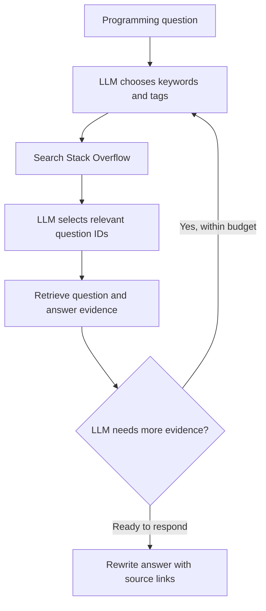

# Stack Overflow Agentic RAG

**Ask a programming question. Get a rewritten explanation grounded in Stack Overflow answers, with links to the sources.**

The LLM chooses search terms, selects relevant questions, reads their answers, and can
refine its search before responding. Stack Overflow supplies the knowledge at query time.

## Run the demo

Requires Python 3.14+ and [uv](https://docs.astral.sh/uv/getting-started/installation/).

```bash
uv sync --locked --extra notebook
```

Create a `.env` file in the repository root and set your LLM credential:

```dotenv
OLLAMA_API_KEY=your_key_here
```

```bash
uv run --extra notebook jupyter lab notebooks/demo.ipynb
```

Select the project's `.venv` Python kernel, run the cells in order, and edit `question`.

> Try: **How do I remove duplicates from a Python list while keeping their order?**

The default provider is Ollama cloud, using `gemma4:31b` at `https://ollama.com/v1`.
Public Stack Overflow searches and answer retrieval require no API key.
Optional overrides are `LLM_API_KEY`, `LLM_BASE_URL`, and `LLM_MODEL`.
`LLM_API_KEY` takes precedence over `OLLAMA_API_KEY`; alternative providers must support
OpenAI-compatible Chat Completions tool calling.

## How it works



The first search is required. The model selects up to three retrieved question IDs in
relevance order. Answers are ordered by acceptance status and vote score. Tool calls
and results stay in the current conversation so later decisions can use earlier evidence.

Searches return up to eight candidates and answer retrieval returns up to two answers
per question. The default budget is six tool executions across at most six loop rounds,
followed by at most one final synthesis call. Question and answer excerpts are capped
at 3,000 and 8,000 characters.

Identical question records are not repeated in later search outputs within one request.
HTTP responses are cached for 60 seconds, with at most 128 entries. API cooldowns are
returned as tool errors so the agent can respond or choose another action.

Numeric citations resolve to retrieved answer URLs. Sources include authors and license
labels returned by the API. No answer evidence produces an insufficient-evidence response.

## Structure

```text
.
├── notebooks/demo.ipynb  # Interactive entry point
├── src/stackoverflow_agentic_rag/
│   ├── __init__.py       # Public package exports
│   ├── agent.py          # Tool schemas, agent loop, and citations
│   └── stackoverflow.py  # API retrieval, HTML extraction, and caching
├── pyproject.toml       # Dependencies and tooling
└── uv.lock              # Dependency lockfile
```

The core package needs only `openai` and `requests`. Notebook dependencies are optional.
Import the agent with `from stackoverflow_agentic_rag import AgenticRAG`, supply a configured LLM client,
and call `agent.ask(question)`.

## Tradeoffs

- Question ranking and evidence sufficiency are judged by the LLM; there is no separate
  scoring model or independent verifier for every generated claim.
- Each `ask()` starts fresh conversation state. The HTTP cache can survive across calls,
  but conversation memory does not.
- Character-limited excerpts may omit details from long posts.
- Retrieval depends on Stack Exchange API availability, cooldowns, and quota.
- Use an agent instance sequentially. The demo does not provide a web server.

## References

- [Stack Exchange search API](https://api.stackexchange.com/docs/advanced-search)
- [Answer retrieval](https://api.stackexchange.com/docs/answers-on-questions)
- [API throttling and backoff](https://api.stackexchange.com/docs/throttle)
- [OpenAI function calling](https://developers.openai.com/api/docs/guides/function-calling)
