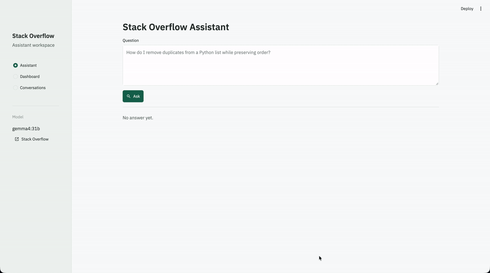
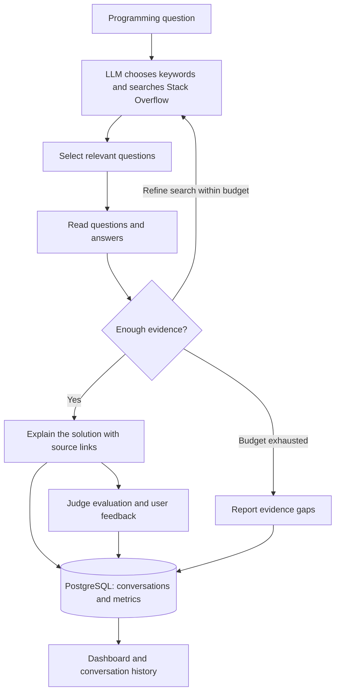

# Stack Overflow Agentic RAG

**Ask a programming question. Get an explanation grounded in Stack Overflow answers, with links to the sources.**

A Streamlit application where an LLM chooses search terms, selects relevant questions,
reads their answers, and refines its search when needed. PostgreSQL stores conversations,
metrics, judge evaluations, and user feedback for the dashboard.

## Demo



*Animated illustration using sample data.*

## Run with Docker Compose

Requires Docker with the Compose plugin and an Ollama cloud API key.
Run all commands from the repository root.

Create `.env` with the following settings, replacing the credential placeholders:

```dotenv
POSTGRES_DB=rag_faq
POSTGRES_USER=rag_faq
POSTGRES_PASSWORD=replace_with_your_password
OLLAMA_API_KEY=replace_with_your_key
LLM_INPUT_PRICE_PER_MILLION=0.14
LLM_CACHED_INPUT_PRICE_PER_MILLION=0.05
LLM_OUTPUT_PRICE_PER_MILLION=0.40
```

The rates above are for Gemma 4; check [Ollama pricing](https://ollama.com/pricing)
when setting them. Restrict access with `chmod 600 .env`.
Real credentials stay in `.env`, which is ignored by Git and excluded from builds.

Start PostgreSQL and Streamlit:

```bash
docker compose up --build -d
```

Open [localhost:8501](http://localhost:8501). The app waits for PostgreSQL to become
healthy and initializes its tables automatically. Database data persists across restarts.

```bash
docker compose logs -f streamlit  # View application logs
docker compose down             # Stop services and retain database data
```

After editing `.env`, recreate the app with `docker compose up --build -d streamlit`.

## Run locally

Requires Python 3.14+, [uv](https://docs.astral.sh/uv/getting-started/installation/),
and the same `.env` configuration. Use `POSTGRES_HOST=localhost` for local Python.

```bash
uv sync --locked --no-editable
make postgres
make db-init
make chat
```

This starts the database in Docker and runs Streamlit locally. Run either the local
app or the Compose app on port 8501.

For a command-line answer:

```bash
uv run --locked --no-editable stackoverflow-assistant "How do I remove duplicates from a Python list while preserving order?"
```

The default model is `gemma4:31b` at `https://ollama.com/v1`. Override it with
`LLM_MODEL` and `LLM_BASE_URL` in `.env`. `LLM_API_KEY` takes precedence over
`OLLAMA_API_KEY` for other compatible providers. Stack Overflow retrieval needs no API key.

## How it works



The **Assistant** shows answers, token usage, response time, estimated cost, and relevance
judgments, with helpful/not helpful feedback buttons. The **Dashboard** shows aggregate
metrics, relevance and feedback distributions, cost and response-time charts, and recent
conversations. **Conversations** lets you search saved answers and filter by model.

Answers use retrieved evidence and retain source attribution. If retrieval provides
insufficient evidence, the agent reports that limitation. Cost estimates use configured
rates for new conversations; missing rates default to zero.


## Project structure

```text
.
├── src/stackoverflow_agentic_rag/
│   ├── __init__.py      # Public agent and record types
│   ├── __main__.py      # Python module entry point
│   ├── agent.py         # Agent loop, tools, citations, and metrics
│   ├── cli.py           # Command-line entry point and assistant factory
│   ├── config.py        # Environment configuration and LLM client
│   ├── database.py      # PostgreSQL schema, persistence, and statistics
│   ├── judge.py         # Answer relevance evaluation
│   ├── metrics.py       # Conversation records and cost calculation
│   ├── stackoverflow.py # Stack Exchange API retrieval
│   ├── styles.py        # UI styles
│   └── ui.py            # Streamlit views and session state
├── app.py               # Streamlit entry point
├── assets/              # README demo GIF
├── .streamlit/           # Streamlit theme
├── compose.yaml
├── Dockerfile
├── Makefile
├── pyproject.toml
└── uv.lock
```

`uv sync --locked --no-editable` installs the package and its command-line entry points.
Run `make check` for lint and formatting checks, or `make format` to format the code.
